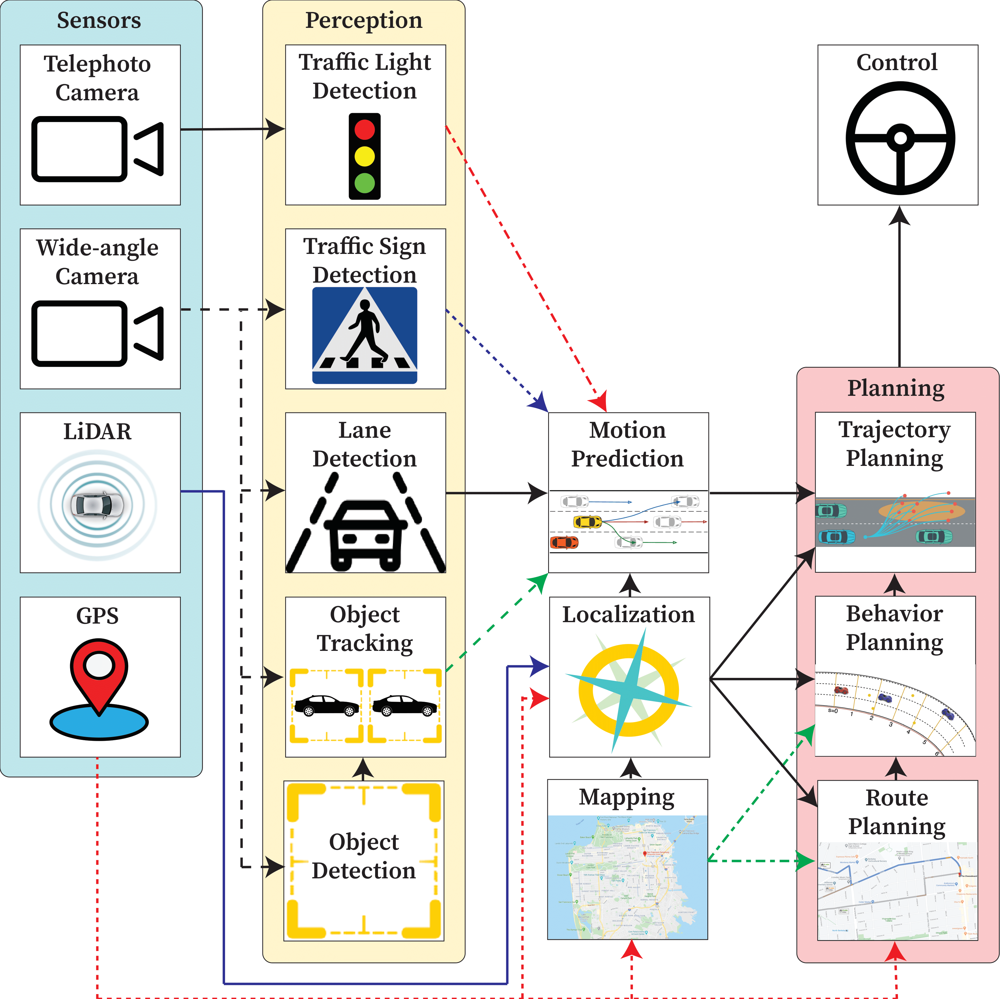

Pylot
=====

Pylot is an autonomous vehicle platform for developing and testing autonomous
vehicle components (e.g., perception, prediction, planning) on the
CARLA simulator and real-world cars.

.. _`codebase on GitHub`: https://github.com/erdos-project/pylot

More Information
----------------

Slides
~~~~~~
- `Talk given at RISE Retreat 2020 <https://drive.google.com/open?id=1i_Wl27ovVRzdz5UgozjoHgYgHL3HOmTd>`_

Getting Involved
----------------
- `GitHub Issues`_: For reporting bugs and feature requests.
- `Pull Requests`_: For submitting code contributions.

.. _`GitHub Issues`: https://github.com/erdos-project/pylot/issues
.. _`Pull Requests`: https://github.com/erdos-project/pylot/pulls

.. toctree::
   :maxdepth: -1
   :caption: Installation guide

   quick_start.rst
   manual_installation.rst

.. toctree::
   :maxdepth: -1
   :caption: Components

   perception.rst
   prediction.rst
   localization.rst
   map.rst
   planning.rst
   control.rst

.. toctree::
   :maxdepth: -1
   :caption: Visualization

   visualization.rst

.. toctree::
   :maxdepth: -1
   :caption: Simulation

   simulation.rst

.. toctree::
   :maxdepth: -1
   :caption: Drivers

   drivers.rst

.. toctree::
   :maxdepth: -1
   :caption: Deploying on a car

   deploy.rst   

.. toctree::
   :maxdepth: -1
   :caption: Data Gathering

   data_gathering.rst

.. toctree::
   :maxdepth: -1
   :caption: Package Reference

   package_reference.rst
