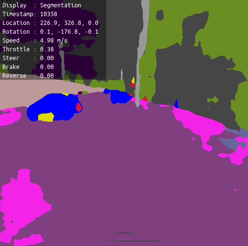

Segmentation
============

The package provides operators and classes useful for segmenting camera frames:

- `SegmentedFrame <pylot.perception.segmentation.html#module-pylot.perception.segmentation.segmented_frame>`__
  is the class used to store segmented frames. It also provides utilities to
  transform a frame between different encodings (e.g., CARLA, Cityscapes), and
  to compute accuracy metrics (e.g., mIoU).
- `SegmentationDRNOperator <pylot.perception.segmentation.html#module-pylot.perception.segmentation.segmentation\_drn\_operator>`__
  is an operator that uses the `DRN <https://github.com/ICGog/drn>`_ neural
  network to segment camera frames.
- `SegmenationEvalOperator <pylot.perception.segmentation.html#module-pylot.perception.segmentation.segmentation\_eval\_operator>`__
  implements logic to evaluate the output of a segmentation operator. It
  receives data on two streams and computes intersection over union (IoU)
  between the frames tagged with the same timestamp.

Execute the following command to run a semantic segmentation demo:

.. code-block:: bash

    python3 pylot.py --flagfile=configs/segmentation.conf

**Note**: The segmentation model we used has not been trained on CARLA data, and
the output of the segmentation component is not currently used by any other
Pylot components.

Important flags
---------------

- ``--segmentation``: Enables the segmentation component of the stack.
- ``--segmentation_model_path``: File path to a trained DRN segmentation model.
- ``--perfect_segmentation``: The component outputs perfectly segmented frames
  it receives from the simulator, instead of the results obtained using a
  trained model.
- ``--visualize_segmentation``: Enables visualization of the output of the
  segmentation component.
- ``--evaluate_segmentation``: Compute and log accuracy metrics of the
  segmentation component.
- ``--segmentation_metric``: Sets the accuracy metric the
  SegmentationEvalOperator computes.

More information
----------------
See the `reference <pylot.perception.segmentation.html>`_ for more information.
