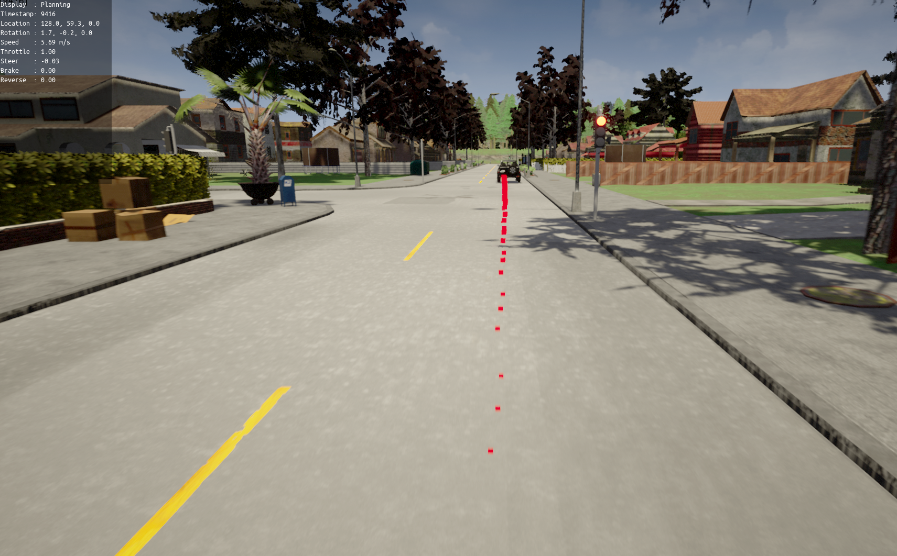

Planning
========

The package provides operators and classes useful for planning the trajectory
the ego vehicle must follow. The planners ensure the ego-vehicle follows the
lanes, decide when the ego-vehicle must brake to avoid collision with other
agents and static obstacles, ensure that the ego-vehicle respects traffic
lights.

Execute the following command to run a planning demo:

.. code-block:: bash

    # To run the Frenet Optimal Trajectory planner.
    python3 pylot.py --flagfile=configs/frenet_optimal_trajectory_planner.conf

    # To run the RRT* planner.
    python3 pylot.py --flagfile=configs/rrt_star_planner.conf

    # To run the Hybrid A* planner.
    python3 pylot.py --flagfile=configs/hybrid_astar_planner.conf

Important flags
---------------

- ``--planning_type``: Sets which planner to use. Pylot currentlys offers four
  alternatives: waypoint following, `Frenet optimal trajectory <pylot.planning.frenet_optimal_trajectory.html#module-pylot.planning.frenet\_optimal\_trajectory.fot\_planner>`_,
  `RRT* <pylot.planning.rrt_star.html#module-pylot.planning.rrt\_star.rrt\_star\_planner>`_,
  and `Hybrid A* <pylot.planning.hybrid_astar.html#module-pylot.planning.hybrid\_astar.hybrid\_astar\_planner>`_.
- ``--visualize_waypoints``: Enables visualization of the waypoints computed
  by the planning operators.
- ``--draw_waypoints_on_world``: Enables drawing of waypoints directly in the
  simulator.
- ``--draw_waypoints_on_camera_frames``: Enables drawing of waypoints on camera
  frames.
- ``--target_speed``: Sets the desired ego-vehicle target speed.
- ``--num_waypoints_ahead``: Number of future waypoints to plan for.
- ``--num_waypoints_behind``: Number of past waypoints to use while planning.
- ``--obstacle_distance_threshold``: Obstacles that are more than this many
  meters away from the ego-vehicle are not going to be considered in the
  planner.

**Note:** Each planner has further other flags, which are not described here.

More information
----------------
See the `reference <pylot.planning.html>`_ for more information.
