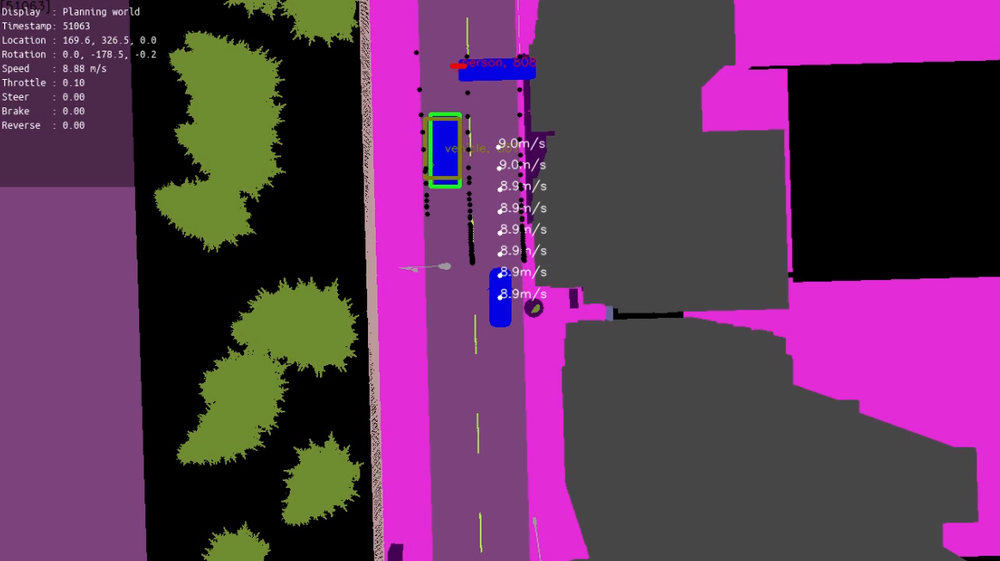

Prediction
==========

The package provides operators and classes useful for predicting future
trajectories of other agents. Pylot predicts future trajectories of obstacles
detected and tracked by the perception component. However, if you desire to
run the prediction components using perfectly tracked obstacles, you can pass
``--perfect_obstacle_tracking`` when you're running in simulation.

Execute the following command to run a prediction demo:

.. code-block:: bash

    python3 pylot.py --flagfile=configs/prediction.conf

    
Important flags
---------------

- ``--prediction``: Enables the prediction component of the pipeline.
- ``--prediction_type``: Sets which prediction operator to use. Pylot currently
  offers two prediction implementations: a simple
  `linear predictor <pylot.prediction.html#module-pylot.prediction.linear\_predictor\_operator>`__
  and `R2P2 <https://people.eecs.berkeley.edu/~nrhinehart/R2P2.html>`__.
- ``--prediction_num_past_steps``: Sets the number of past obstacle locations
  the prediction components uses. The duration of the history used for
  prediction is equal to the number of past steps multiplied by the time between
  each step run.
- ``--prediction_num_future_steps``: Sets the number of future steps to predict.
- ``--evaluate_prediction``: Enables computation and logging of accuracy metrics
  of the prediction component.
- ``--visualize_prediction``: Enables visualization of predicted obstacle
  trajectories.

More information
----------------
See the `reference <pylot.prediction.html>`_ for more information.
