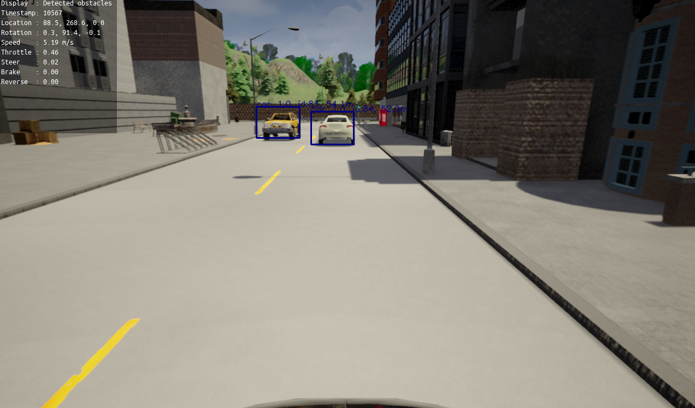
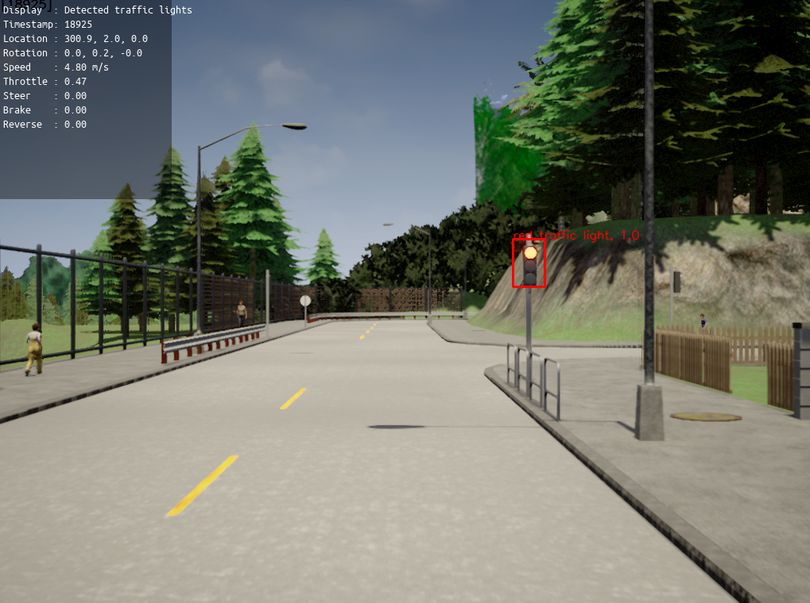
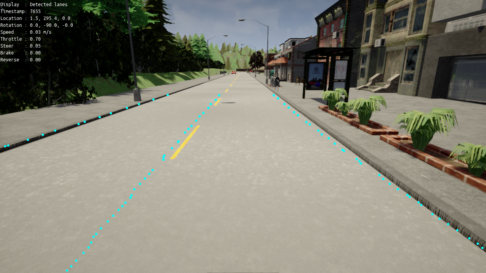

Visualization
=============

Important flags
---------------

The following flags can be set to enable visualization of the output and state
of the different Pylot components. The visualization is done in a pygame window,
and users can switch between different views by pressing ``n``.

- ``--visualize_rgb_camera``: Enables the visualization of the camera.
- ``--visualize_depth_camera``: Enables the visualization of the depth
  estimation.
- ``--visualize_lidar``: Enables top down visualization of the LiDAR.
- ``--visualize_detected_obstacles``: Enables visualization of detected
  obstacles.
- ``--visualize_detected_traffic_lights``: Enables visualization of detected
  traffic lights.
- ``--visualize_detected_lanes``: Enables visualization of detected lanes.
- ``--visualize_tracked_obstacles``: Enables the visualization of tracked
  obstacles. The visualization includes info such as: id of the obstacle,
  distance from ego vehicle, label.
- ``--visualize_segmentation``: Enables the visualization of segmented frames.
- ``--visualize_waypoints``: Enables the visualization of the waypoints output
  by the planning component. These waypoints can be drawn on the camera
  frame (pass ``-draw_waypoints_on_camera_frames``), or directly in the
  simulator when running in simulation mode
  (pass ``--draw_waypoints_on_world``).
- ``--visualize_world``: Enables visualization of the current state of the
  ego-vehicle. This is the best way to visualize what the self-driving car is
  currently perceiving and predicting. This visualization includes the past
  trajectories and predicted future trajectories of other agents, detected
  traffic lights and lanes, and the waypoints the ego-vehicle is trying to
  follow.

Flags that only work when running in simulation:

- ``--visualize_imu``: Enables visualization of the IMU.
- ``--visualize_pose``: Enables the visualization of the ego-vehicle pose.
- ``--visualize_prediction``: Enables the visualization of obstacle predictions.

Examples
--------

**Obstacle detection:**
  

**Traffic light detection:**

**Lane detection:**

**Planning waypoints:**

.. image:: images/pylot-planning.png
     :align: center

**Planning world:**

In this visualization the ego-vehicle is driving forward at 9.0 meters per
second, the vehicle on the opposite lane is stationary, and the prediction
component predicts that the predestrian will cross the street.

.. image:: images/world-visualization.png
     :align: center
